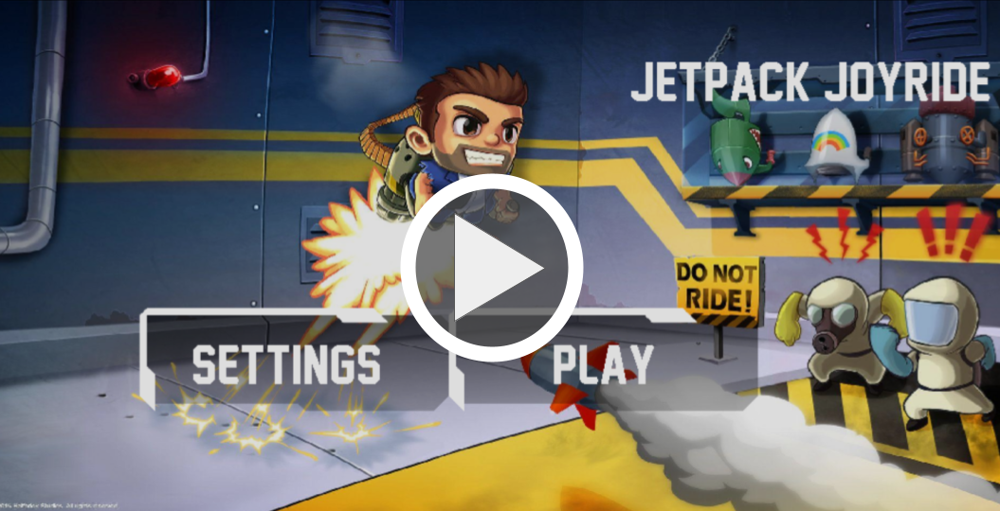
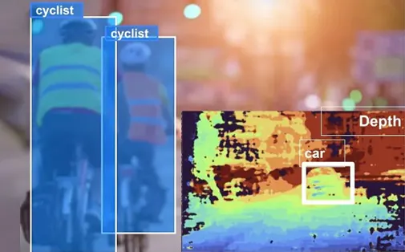

Below are some projects I've worked on:

### Jetpack Joyride Clone in C

- This project was a part of Software Design class at Caltech.
- We developed a Jetpack Joyride clone in pure C with multiple functionalities
    - File storage
    - Probablistic Difficulty
    - Obstacle Passability
    - Scrolling Background
    - Animation
    - Game UI
- We utilized SDL2 and Emscripten (WebAssembly) to develop this game and developed our server-client system to host it. 
- This project was developed in under 2 weeks with some starter code for physics engine in C that we developed during the course.
[Project link](https://github.com/Adarsh321123/Jetpack-Joyride)

### HapticCV: depth-assisted bicycle navigation

- Cars have been equipped with all sorts of sensors to make them safer and smarter. Unfortunately, cyclists haven’t had the same benefits. 
- Haptic CV gives cyclists a feel for what is going on behind them through the use of computer vision. Information about the depth of vehicles behind the users is sent via Buzz to the skin, giving them accurate information about the dangers that may be speeding upon them. 
- I developed a real-time obstacle detection on OAK-D for cyclists using stereo depth estimation, object tracking using MobileNet SSD and haptic feedback using neosensory buzz

[Project link](https://www.hackster.io/dhruvsheth_/hapticcv-spatialai-haptic-stimulus-based-cycle-assistance-167f79)

### Gelare: prototyping platform for assistive robotics

- The idea is to bring robotic manipulation performing real-time computer vision with RGBD sensors to an accessible platform for prototyping. 
- For this, we quantized and deployed computer vision models using a CNN architecture built for embedded devices called FOMO (Faster Objects, More Objects) and got the ML model processing RGB and Stereo Depth data under 3Mb ram and 1mW power at 30FPS.
- Using this platform, we then developed an assistive-robotic application for robot assisted feeding

[Project link](https://github.com/dhruvmsheth/Gelare)
